# Business Pitch

## Jawaban UAS

Sourcode:

- [Frontend-Mobile](https://gitlab.com/fikiaprian23/fronted-chatbro)
- [Backend](https://gitlab.com/fikiaprian23/backend-ta-oop)
- [Web Admin/Perusahaan](https://gitlab.com/fikiaprian23/webperusahaan-ta-oop)

# No 1

Mampu menunjukkan keseluruhan Use Case beserta ranking dari tiap Use Case dari produk digital:

- **Use case user**

| No. | Use Case                    | Deskripsi                                                                       | Prioritas | Class Terkait                |
| --- | --------------------------- | ------------------------------------------------------------------------------- | --------- | ---------------------------- |
| 1   | Mengirim Pesan              | Pengguna dapat mengirim pesan teks ke kontak lain.                              | Tinggi    | Message, ChatController      |
| 2   | Mengirim Gambar             | Pengguna dapat mengirim gambar ke kontak lain.                                  | Tinggi    | Message, ChatController      |
| 3   | Mengirim Video              | Pengguna dapat mengirim video ke kontak lain.                                   | Tinggi    | Message, ChatController      |
| 4   | Mengirim Pesan Suara        | Pengguna dapat mengirim pesan suara ke kontak lain.                             | Tinggi    | Message, ChatController      |
| 5   | Membuat Grup                | Pengguna dapat membuat grup obrolan dengan kontak.                              | Tinggi    | Group, GroupController       |
| 6   | Bergabung Grup              | Pengguna dapat bergabung dengan grup obrolan.                                   | Tinggi    | Group, GroupController       |
| 7   | Mengirim Lokasi             | Pengguna dapat mengirim lokasi ke kontak lain.                                  | Tinggi    | MapController                |
| 8   | Mengirim Kontak             | Pengguna dapat mengirim kontak ke kontak lain.                                  | Tinggi    | ChatContoller, Contact, User |
| 9   | Mengirim Dokumen            | Pengguna dapat mengirim dokumen ke kontak lain.                                 | Tinggi    | ChatContoller, File          |
| 10  | Mengirim Pesan Broadcast    | Pengguna dapat mengirim pesan broadcast ke beberapa kontak sekaligus.           | Tinggi    | ChatContoller                |
| 11  | Mengirim Pesan Otomatis     | Pengguna dapat mengatur pesan otomatis untuk memberikan respons cepat.          | Sedang    | Chat                         |
| 12  | Mengatur Profil             | Pengguna dapat mengatur foto profil, status, dan informasi profil lainnya.      | Sedang    | Profil,settings              |
| 13  | Mengatur Privasi            | Pengguna dapat mengatur pengaturan privasi, seperti status terlihat atau tidak. | Sedang    | Privasi, settings            |
| 14  | Mengatur Notifikasi         | Pengguna dapat mengatur pengaturan notifikasi, seperti nada dering atau getar.  | Sedang    | Notifikasi, settings         |
| 15  | Mengatur Status Teks        | Pengguna dapat mengatur status teks yang bisa dilihat oleh kontaknya.           | Sedang    | Status                       |
| 16  | Mengatur Status Gambar      | Pengguna dapat mengatur status dengan menggunakan gambar.                       | Sedang    | Status                       |
| 17  | Mengatur Status Video       | Pengguna dapat mengatur status dengan menggunakan video.                        | Sedang    | Status                       |
| 18  | Mengatur Status GIF         | Pengguna dapat mengatur status dengan menggunakan GIF animasi.                  | Sedang    | Status                       |
| 19  | Mengatur Status Audio       | Pengguna dapat mengatur status dengan menggunakan audio.                        | Sedang    | Status                       |
| 20  | Mengatur Status Tautan      | Pengguna dapat mengatur status dengan menggunakan tautan.                       | Sedang    | Status                       |
| 21  | Mengubah Tema               | Pengguna dapat mengubah tema tampilan aplikasi WhatsApp.                        | Rendah    | Tampilan                     |
| 22  | Mengarsipkan Pesan          | Pengguna dapat mengarsipkan pesan untuk menyimpannya tanpa menghapusnya.        | Rendah    | Pesan                        |
| 23  | Membuat Cadangan Pesan      | Pengguna dapat membuat cadangan pesan untuk menyimpannya secara terpisah.       | Rendah    | Cadangan                     |
| 24  | Menggunakan Fitur Panggilan | Pengguna dapat melakukan panggilan suara dan video dengan kontak lain.          | Rendah    | Panggilan                    |
| 25  | Mengirim Stiker             | Pengguna dapat mengirim stiker ke kontak lain.                                  | Rendah    | Stiker                       |
| 26  | Registrasi                  | Pengguna dapat mendaftar ke aplikasi.                                           | tinggi    | User, AuthController         |

- **Use case manajemen perusahaan**

| No. | Use Case                     | Deskripsi                                                                                             | Prioritas |
| --- | ---------------------------- | ----------------------------------------------------------------------------------------------------- | --------- |
| 1   | Membuat Akun                 | Manajer perusahaan dapat membuat akun perusahaan di WhatsApp.                                         | Tinggi    |
| 2   | Mengelola Pengguna           | Manajer perusahaan dapat mengelola pengguna yang terdaftar di akun perusahaan.                        | Tinggi    |
| 3   | Mengatur Hak Akses           | Manajer perusahaan dapat mengatur hak akses pengguna berdasarkan peran mereka.                        | Tinggi    |
| 4   | Mengirim Pesan Massal        | Manajer perusahaan dapat mengirim pesan massal ke seluruh pengguna perusahaan.                        | Tinggi    |
| 5   | Mengelola Grup               | Manajer perusahaan dapat membuat, mengelola, dan mengatur grup obrolan perusahaan.                    | Tinggi    |
| 6   | Mengirim Pengumuman          | Manajer perusahaan dapat mengirim pengumuman penting kepada seluruh pengguna.                         | Sedang    |
| 7   | Mengelola Kontak             | Manajer perusahaan dapat mengelola daftar kontak perusahaan.                                          | Sedang    |
| 8   | Mengintegrasikan Sistem      | Manajer perusahaan dapat mengintegrasikan WhatsApp dengan sistem perusahaan lainnya.                  | Sedang    |
| 9   | Mengatur Pengaturan Keamanan | Manajer perusahaan dapat mengatur pengaturan keamanan seperti enkripsi dan verifikasi dua faktor.     | Sedang    |
| 10  | Melacak Aktivitas            | Manajer perusahaan dapat melacak aktivitas pengguna seperti pesan yang dikirim dan diterima.          | Sedang    |
| 11  | Mengelola Riwayat Pesan      | Manajer perusahaan dapat mengelola dan menyimpan riwayat pesan perusahaan.                            | Rendah    |
| 12  | Mengelola Pelaporan          | Manajer perusahaan dapat mengakses dan mengelola pelaporan terkait penggunaan WhatsApp di perusahaan. | Rendah    |

- **Use case direksi perusahaan (dashboard, monitoring, analisis)**

| No. | Use Case                           | Deskripsi                                                                                                                                                     | Prioritas |
| --- | ---------------------------------- | ------------------------------------------------------------------------------------------------------------------------------------------------------------- | --------- |
| 1   | Melihat Dashboard                  | Direksi perusahaan dapat melihat dashboard yang memberikan gambaran menyeluruh tentang kinerja perusahaan dalam aplikasi WhatsApp.                            | Tinggi    |
| 2   | Memonitor KPI Perusahaan           | Direksi perusahaan dapat memonitor Key Performance Indicators (KPI) perusahaan dalam aplikasi WhatsApp.                                                       | Tinggi    |
| 3   | Memonitor Penggunaan Aplikasi      | Direksi perusahaan dapat memonitor penggunaan aplikasi WhatsApp oleh pengguna perusahaan dalam aplikasi WhatsApp.                                             | Sedang    |
| 4   | Memonitor Kinerja Grup             | Direksi perusahaan dapat memonitor kinerja grup obrolan dalam aplikasi WhatsApp yang digunakan oleh pengguna perusahaan.                                      | Sedang    |
| 5   | Memonitor Kinerja Panggilan        | Direksi perusahaan dapat memonitor kinerja panggilan suara dan video dalam aplikasi WhatsApp.                                                                 | Sedang    |
| 6   | Menganalisis Data Pengguna         | Direksi perusahaan dapat menganalisis data pengguna WhatsApp, seperti demografi pengguna, preferensi pengguna, dan perilaku pengguna dalam aplikasi WhatsApp. | Tinggi    |
| 7   | Melihat Laporan Aktivitas Pengguna | Direksi perusahaan dapat melihat laporan aktivitas pengguna dalam aplikasi WhatsApp, seperti jumlah pesan yang dikirim dan diterima.                          | Sedang    |
| 8   | Memonitor Keamanan dan Kepatuhan   | Direksi perusahaan dapat memonitor keamanan dan kepatuhan penggunaan aplikasi WhatsApp dalam perusahaan.                                                      | Tinggi    |
| 9   | Menganalisis Keterlibatan Pengguna | Direksi perusahaan dapat menganalisis tingkat keterlibatan pengguna dalam aplikasi WhatsApp, seperti jumlah pesan yang dibaca dan tanggapan pengguna.         | Sedang    |
| 10  | Melihat Laporan Pelaporan          | Direksi perusahaan dapat melihat laporan pelaporan terkait penggunaan WhatsApp di perusahaan, termasuk pelanggaran kebijakan dan masalah keamanan.            | Sedang    |

# No 2

Mampu mendemonstrasikan Class Diagram dari keseluruhan Use Case produk digital

Jawab:
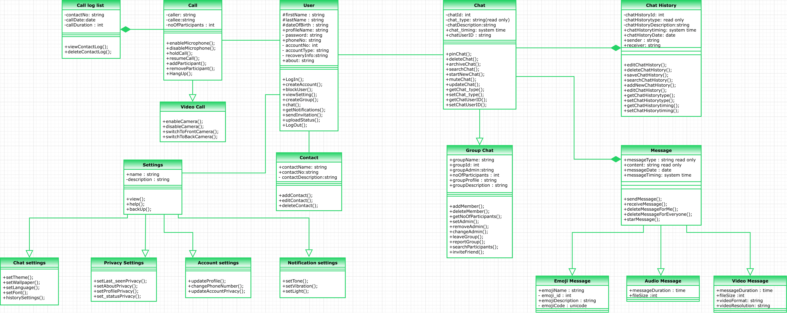

# No 3

Mampu menunjukkan dan menjelaskan penerapan setiap poin dari SOLID Design Principle

Jawab:

Penjelasan yang sederhana dan mudah dipahami untuk setiap poin dalam SOLID Design Principle:

1. **Single Responsibility Principle (SRP)**: Satu kelas seharusnya hanya memiliki satu tanggung jawab utama. Artinya, kelas tersebut harus fokus dan bertanggung jawab dalam melakukan satu hal secara konkret. Hal ini membantu menjaga kelas tetap sederhana dan mudah dipahami.

2. **Open-Closed Principle (OCP)**: Sebuah entitas (kelas, modul, atau fungsi) harus terbuka untuk perluasan namun tertutup untuk modifikasi. Ini berarti kita harus dapat menambahkan fitur baru atau mengubah perilaku entitas tanpa harus memodifikasi kode yang sudah ada. Hal ini memudahkan pengembangan dan perawatan kode dalam jangka panjang.

3. **Liskov Substitution Principle (LSP)**: Objek dari kelas turunan harus dapat digunakan sebagai pengganti objek kelas induk tanpa mengubah kebenaran program. Dengan kata lain, jika sebuah kelas A adalah subkelas dari kelas B, maka objek dari kelas A harus dapat digunakan di mana pun objek kelas B digunakan. Prinsip ini memastikan bahwa subkelas tidak memperkenalkan efek samping atau perubahan perilaku yang tidak diharapkan.

4. **Interface Segregation Principle (ISP)**: Klien tidak boleh dipaksa bergantung pada antarmuka yang tidak mereka gunakan. Prinsip ini menyatakan bahwa antarmuka harus dibagi menjadi bagian-bagian yang lebih kecil dan spesifik agar klien hanya bergantung pada apa yang mereka butuhkan. Dengan cara ini, perubahan pada satu bagian antarmuka tidak mempengaruhi klien yang tidak membutuhkan bagian tersebut.

5. **Dependency Inversion Principle (DIP)**: Modul tingkat tinggi tidak boleh bergantung pada modul tingkat rendah. Keduanya seharusnya bergantung pada abstraksi. Prinsip ini menyatakan bahwa ketergantungan antara kelas harus tergantung pada abstraksi (interface atau kelas abstrak), bukan pada implementasi konkrit. Hal ini memudahkan penggantian implementasi tanpa mempengaruhi kelas yang bergantung padanya.

Semua prinsip SOLID ini bertujuan untuk membuat kode lebih mudah dipahami, dioptimalkan, diperluas, dan dikelola dengan baik. Dengan menerapkan prinsip-prinsip ini, kita dapat menciptakan kode yang lebih fleksibel, modular, dan mudah diubah tanpa mengorbankan kualitas dan keberlanjutan kode.

- Contoh penerapan SOLID Design Principle dalam class MessageService

```java
package com.fikiap.chatbrobackendapi.service;

import java.util.ArrayList;
import java.util.HashMap;
import java.util.List;
import java.util.Map;

import org.springframework.http.HttpStatus;
import org.springframework.http.ResponseEntity;
import org.springframework.stereotype.Service;

import com.fikiap.chatbrobackendapi.config.DatabaseConnection;
import com.fikiap.chatbrobackendapi.entity.Message;
import com.google.api.core.ApiFuture;
import com.google.cloud.firestore.CollectionReference;
import com.google.cloud.firestore.DocumentReference;
import com.google.cloud.firestore.DocumentSnapshot;
import com.google.cloud.firestore.Firestore;
import com.google.cloud.firestore.QueryDocumentSnapshot;
import com.google.cloud.firestore.QuerySnapshot;

@Service
public class MessageService {
private static final String USERS_COLLECTION_NAME = "users";
private static final String MESSAGE_SUBCOLLECTION_NAME = "messages";
private final Firestore dbFirestore;
public MessageService(DatabaseConnection databaseConnection) {
    this.dbFirestore = databaseConnection.getFirestore();
}

/**
 * Menyimpan pesan dalam koleksi pesan di dalam dokumen kontak pengguna.
 *
 * @param userId    ID pengguna
 * @param contactId ID kontak pengguna
 * @param message   Objek Message yang akan disimpan
 * @return ResponseEntity dengan pesan sukses atau pesan kesalahan
 */
public ResponseEntity<Map<String, Object>> saveMessage(String userId, String contactId, Message message) {
    try {
        DocumentReference contactDocument = dbFirestore.collection(USERS_COLLECTION_NAME)
                .document(userId)
                .collection("chats")
                .document(contactId);

        // Buat subkoleksi MESSAGE_SUBCOLLECTION_NAME di dalam dokumen kontak
        CollectionReference messageCollection = contactDocument.collection(MESSAGE_SUBCOLLECTION_NAME);

        // Simpan pesan di dalam subkoleksi MESSAGE_SUBCOLLECTION_NAME dengan menggunakan messageId sebagai nama dokumen
        DocumentReference messageDocument = messageCollection.document(message.getMessageId());
        messageDocument.set(message);

        Map<String, Object> response = new HashMap<>();
        response.put("code", "200");
        response.put("status", "OK");
        response.put("data", message);

        return ResponseEntity.ok(response);
    } catch (Exception e) {
        return createErrorResponse(HttpStatus.INTERNAL_SERVER_ERROR, e.getMessage());
    }
}

/**
 * Mengambil detail pesan dari koleksi pesan di dalam dokumen kontak pengguna.
 *
 * @param userId    ID pengguna
 * @param contactId ID kontak pengguna
 * @return ResponseEntity dengan daftar pesan atau pesan kesalahan
 */
public ResponseEntity<Map<String, Object>> getMessageDetails(String userId, String contactId) {
    try {
        DocumentReference contactDocument = dbFirestore.collection(USERS_COLLECTION_NAME)
                .document(userId)
                .collection("chats")
                .document(contactId);

        // Dapatkan subkoleksi MESSAGE_SUBCOLLECTION_NAME di dalam dokumen kontak
        CollectionReference messageCollection = contactDocument.collection(MESSAGE_SUBCOLLECTION_NAME);

        // Dapatkan semua dokumen pesan dari subkoleksi MESSAGE_SUBCOLLECTION_NAME
        ApiFuture<QuerySnapshot> future = messageCollection.get();
        QuerySnapshot querySnapshot = future.get();
        List<Message> messageList = new ArrayList<>();

        for (QueryDocumentSnapshot document : querySnapshot.getDocuments()) {
            Message message = document.toObject(Message.class);
            messageList.add(message);
        }

        Map<String, Object> response = new HashMap<>();
        response.put("code", "200");
        response.put("status", "OK");
        response.put("data", messageList);

        return ResponseEntity.ok(response);
    } catch (Exception e) {
        return createErrorResponse(HttpStatus.INTERNAL_SERVER_ERROR, e.getMessage());
    }
}

/**
 * Memperbarui pesan dalam koleksi pesan di dalam dokumen kontak pengguna.
 *
 * @param userId    ID pengguna
 * @param contactId ID kontak pengguna
 * @param message   Objek Message yang akan diperbarui
 * @return ResponseEntity dengan pesan sukses, pesan tanpa perubahan, atau pesan kesalahan
 */
public ResponseEntity<Map<String, Object>> updateMessage(String userId, String contactId, Message message) {
    try {
        DocumentReference contactDocument = dbFirestore.collection(USERS_COLLECTION_NAME)
                .document(userId)
                .collection("chats")
                .document(contactId);

        // Dapatkan subkoleksi MESSAGE_SUBCOLLECTION_NAME di dalam dokumen kontak
        CollectionReference messageCollection = contactDocument.collection(MESSAGE_SUBCOLLECTION_NAME);

        // ...

        Map<String, Object> response = new HashMap<>();
        response.put("code", "200");
        response.put("status", "OK");
        response.put(MESSAGE_SUBCOLLECTION_NAME, "Message updated successfully");

        return ResponseEntity.ok(response);
    } catch (Exception e) {
        return createErrorResponse(HttpStatus.INTERNAL_SERVER_ERROR, e.getMessage());
    }
}

/**
 * Menghapus pesan dari koleksi pesan di dalam dokumen kontak pengguna.
 *
 * @param userId    ID pengguna
 * @param contactId ID kontak pengguna
 * @return ResponseEntity dengan pesan sukses atau pesan kesalahan
 */
public ResponseEntity<Map<String, Object>> deleteMessage(String userId, String contactId) {
    try {
        DocumentReference contactDocument = dbFirestore.collection(USERS_COLLECTION_NAME)
                .document(userId)
                .collection("chats")
                .document(contactId);

        // Hapus subkoleksi MESSAGE_SUBCOLLECTION_NAME di dalam dokumen kontak
        CollectionReference messageCollection = contactDocument.collection(MESSAGE_SUBCOLLECTION_NAME);
        ApiFuture<QuerySnapshot> future = messageCollection.get();
        QuerySnapshot querySnapshot = future.get();
        for (QueryDocumentSnapshot document : querySnapshot.getDocuments()) {
            document.getReference().delete();
        }

        Map<String, Object> response = new HashMap<>();
        response.put("code", "200");
        response.put("status", "OK");
        response.put(MESSAGE_SUBCOLLECTION_NAME, "Message deleted successfully");

        return ResponseEntity.ok(response);
    } catch (Exception e) {
        return createErrorResponse(HttpStatus.INTERNAL_SERVER_ERROR, e.getMessage());
    }
}

/**
 * Mengambil semua pesan dari koleksi pesan di dalam dokumen kontak pengguna.
 *
 * @param userId ID pengguna
 * @return ResponseEntity dengan daftar pesan atau pesan kesalahan
 */
public ResponseEntity<Map<String, Object>> getAllMessages(String userId) {
    try {
        CollectionReference collectionReference = dbFirestore.collection(USERS_COLLECTION_NAME)
                .document(userId)
                .collection("chats");
        ApiFuture<QuerySnapshot> future = collectionReference.get();
        QuerySnapshot querySnapshot = future.get();
        Map<String, List<Message>> messageMap = new HashMap<>();

        for (QueryDocumentSnapshot document : querySnapshot.getDocuments()) {
            DocumentReference contactDocument = document.getReference();
            String contactId = document.getId();

            // Dapatkan subkoleksi MESSAGE_SUBCOLLECTION_NAME di dalam dokumen kontak
            CollectionReference messageCollection = contactDocument.collection(MESSAGE_SUBCOLLECTION_NAME);

            // Dapatkan semua dokumen pesan dari subkoleksi MESSAGE_SUB
            ApiFuture<QuerySnapshot> messageFuture = messageCollection.get();
            QuerySnapshot messageQuerySnapshot = messageFuture.get();
            List<Message> messageList = new ArrayList<>();

            for (QueryDocumentSnapshot messageDocument : messageQuerySnapshot.getDocuments()) {
                Message message = messageDocument.toObject(Message.class);
                messageList.add(message);
            }

            messageMap.put(contactId, messageList);
        }

        Map<String, Object> response = new HashMap<>();
        response.put("code", "200");
        response.put("status", "OK");
        response.put("data", messageMap);

        return ResponseEntity.ok(response);
    } catch (Exception e) {
        return createErrorResponse(HttpStatus.INTERNAL_SERVER_ERROR, e.getMessage());
    }
}

/**
 * Membuat ResponseEntity dengan respons kesalahan.
 *
 * @param status       Status HTTP yang akan digunakan dalam respons
 * @param errorMessage Pesan kesalahan
 * @return ResponseEntity dengan pesan kesalahan
 */
private ResponseEntity<Map<String, Object>> createErrorResponse(HttpStatus status, String errorMessage) {
    Map<String, Object> response = new HashMap<>();
    response.put("code", status.toString());
    response.put("status", status.getReasonPhrase());
    response.put("errors", errorMessage);

    return ResponseEntity.status(status).body(response);
}
}
```

Berikut adalah penjelasan penerapan setiap poin dari SOLID Design Principle dalam kelas `MessageService`:

1. **Single Responsibility Principle (SRP)**: Penerapan SRP terlihat pada kelas `MessageService`. Kelas ini memiliki tanggung jawab tunggal, yaitu mengelola pesan dalam sistem. Fungsi-fungsi dalam kelas ini berkaitan dengan operasi pengelolaan pesan, seperti menyimpan, mengambil, memperbarui, dan menghapus pesan. Dengan demikian, kelas ini mematuhi prinsip SRP.

2. **Open-Closed Principle (OCP)**: Meskipun tidak ada implementasi langsung dari prinsip OCP dalam kelas `MessageService`, kelas ini dirancang dengan struktur yang memungkinkan perluasan fungsi-fungsi dalam waktu mendatang. Misalnya, dapat ditambahkan metode baru untuk mengelola pesan dengan logika bisnis yang berbeda. Dalam hal ini, tidak perlu memodifikasi kelas `MessageService` yang ada, tetapi cukup menambahkan metode baru sesuai dengan kebutuhan baru. Sehingga, kelas ini memiliki fleksibilitas untuk perluasan, meskipun tidak sepenuhnya mematuhi prinsip OCP.

3. **Liskov Substitution Principle (LSP)**: Prinsip LSP tidak terlihat dalam kode yang diberikan. Namun, perlu dicatat bahwa tidak ada kelas turunan yang ditunjukkan dalam contoh tersebut. Oleh karena itu, tidak ada evaluasi langsung terhadap penerapan prinsip LSP pada kelas ini.

4. **Interface Segregation Principle (ISP)**: Pada contoh ini, tidak ada antarmuka yang ditunjukkan secara eksplisit dalam kelas `MessageService`. Oleh karena itu, tidak ada masalah dengan prinsip ISP.

5. **Dependency Inversion Principle (DIP)**: Dalam kelas `MessageService`, ketergantungan terhadap implementasi spesifik koneksi database dihindari dengan menerima objek `DatabaseConnection` melalui konstruktor. Ini mengikuti prinsip DIP, karena kelas `MessageService` bergantung pada abstraksi (`DatabaseConnection`) daripada bergantung langsung pada implementasi koneksi database tertentu. Dengan demikian, prinsip DIP diterapkan dengan baik dalam kelas ini.

Meskipun tidak semua prinsip SOLID diimplementasikan secara eksplisit dalam kode tersebut, kelas `MessageService` telah memperlihatkan beberapa prinsip SOLID, seperti SRP dan DIP, dan memiliki fleksibilitas untuk perluasan. Namun, penilaian akhir terhadap penerapan prinsip SOLID harus dipertimbangkan dalam konteks yang lebih luas, termasuk struktur dan kompleksitas keseluruhan sistem yang menggunakan kelas ini.

# No 4

Mampu menunjukkan dan menjelaskan Design Pattern yang dipilih

Jawab:

- #### Singleton pattern
  sebuah desain dalam pemrograman yang memastikan bahwa sebuah kelas hanya memiliki satu objek tunggal yang dapat diakses di seluruh aplikasi. Objek ini diciptakan hanya saat pertama kali diminta dan kemudian diakses ulang setiap kali dibutuhkan. Tujuannya adalah menghindari duplikasi objek dan memberikan akses global ke objek tersebut.

Penerapan Singleton Pattern

```java
package com.fikiap.chatbrobackendapi.config;

import com.google.cloud.firestore.Firestore;
import com.google.firebase.cloud.FirestoreClient;
import org.springframework.stereotype.Component;
import org.springframework.context.annotation.DependsOn;

/**
 * Kelas Singleton untuk mengelola koneksi ke database.
 */
@Component
@DependsOn("firebaseInitialization")
public class DatabaseConnection {
    private static DatabaseConnection instance;
    private Firestore dbFirestore;

    private DatabaseConnection() {
        // Inisialisasi koneksi ke database di sini
        dbFirestore = FirestoreClient.getFirestore();
    }

    /**
     * Mengembalikan instans dari DatabaseConnection.
     *
     * @return Instans dari DatabaseConnection
     */
    public static synchronized DatabaseConnection getInstance() {
        if (instance == null) {
            instance = new DatabaseConnection();
        }
        return instance;
    }

    /**
     * Mengembalikan instans Firestore untuk mengakses database.
     *
     * @return Instans Firestore
     */
    public Firestore getFirestore() {
        return dbFirestore;
    }
}

```

# No 5

Mampu menunjukkan dan menjelaskan konektivitas ke database

Jawab:

- Class untuk mengelola koneksi ke database dengan singleton pattern

```java
package com.fikiap.chatbrobackendapi.config;

import com.google.cloud.firestore.Firestore;
import com.google.firebase.cloud.FirestoreClient;
import org.springframework.stereotype.Component;
import org.springframework.context.annotation.DependsOn;

/**
 * Kelas Singleton untuk mengelola koneksi ke database.
 */
@Component
@DependsOn("firebaseInitialization")
public class DatabaseConnection {
    private static DatabaseConnection instance;
    private Firestore dbFirestore;

    private DatabaseConnection() {
        // Inisialisasi koneksi ke database di sini
        dbFirestore = FirestoreClient.getFirestore();
    }

    /**
     * Mengembalikan instans dari DatabaseConnection.
     *
     * @return Instans dari DatabaseConnection
     */
    public static synchronized DatabaseConnection getInstance() {
        if (instance == null) {
            instance = new DatabaseConnection();
        }
        return instance;
    }

    /**
     * Mengembalikan instans Firestore untuk mengakses database.
     *
     * @return Instans Firestore
     */
    public Firestore getFirestore() {
        return dbFirestore;
    }
}

```

- Class yang menggunkan database dengan objek mengambil objek koneksi database dari Class DatabaseConnection

Admin untuk mengelola database admin

```java
@Service
public class AdminService {
    //nama tabel
    private static final String COLLECTION_NAME = "admins";
    private final Firestore dbFirestore;

    /// Koneksi ke database firestore
    public AdminService(DatabaseConnection databaseConnection) {
        this.dbFirestore = databaseConnection.getFirestore();
    }
}
```

Class StatusService untuk mengelola database status

```java
**
 * Kelas Service yang menangani operasi terkait status.
 */
@Service
public class StatusService {
    //nama tabel
    private static final String COLLECTION_NAME = "status";
    private final Firestore dbFirestore;

    public StatusService(DatabaseConnection databaseConnection) {
        this.dbFirestore = databaseConnection.getFirestore();
    }

}
```

# No 6

Mampu menunjukkan dan menjelaskan pembuatan web service dan setiap operasi CRUD nya

Jawab:

- Saya membuat web service dengan REST dan menggunakan framework Spring boot

- Dokumentasi API dengan OpenApi: [Link Dokumentasi](apidocs/openapi.yaml)

- Sourcode lengkap mengenai web service bisa dilihat sini -> [Backend](https://gitlab.com/fikiaprian23/backend-ta-oop)

- Contoh code CRUD web service dan penjelasannya:

#### 1. Mengelola User

kelas `UserService` yang digunakan untuk mengelola operasi terkait pengguna (user) dalam aplikasi. Berikut adalah penjelasan untuk setiap metode dalam kelas tersebut:

1. `saveUser(User user)`: Metode ini digunakan untuk menyimpan pengguna ke database. Jika data pengguna valid, pengguna akan disimpan di koleksi "users". Metode ini mengembalikan ResponseEntity yang sesuai dengan respons API.

2. `getUserDetails(String uid)`: Metode ini digunakan untuk mengambil detail pengguna berdasarkan ID pengguna (UID). Metode ini akan mencari pengguna dengan UID yang diberikan di koleksi "users" dan mengembalikan detail pengguna jika ditemukan. Jika pengguna tidak ditemukan, akan dikembalikan respons API yang sesuai.

3. `updateUser(User user)`: Metode ini digunakan untuk memperbarui data pengguna di database. Jika data pengguna valid dan terdapat perubahan, data pengguna akan diperbarui di koleksi "users". Metode ini mengembalikan ResponseEntity yang sesuai dengan respons API.

4. `deleteUser(String uid)`: Metode ini digunakan untuk menghapus pengguna dari database berdasarkan ID pengguna (UID). Metode ini akan mencari pengguna dengan UID yang diberikan di koleksi "users" dan menghapusnya jika ditemukan. Metode ini mengembalikan ResponseEntity yang sesuai dengan respons API.

5. `getAllUsers()`: Metode ini digunakan untuk mengambil semua pengguna dari database. Metode ini akan mengambil semua dokumen pengguna dari koleksi "users" dan mengembalikan daftar pengguna dalam respons API.

Setiap metode menggunakan objek `dbFirestore` untuk berinteraksi dengan Firestore, dan respons API yang dihasilkan berisi informasi kode, status, dan pesan yang sesuai dengan operasi yang dilakukan.

Kelas `UserService` ini menggunakan dependensi `DatabaseConnection` untuk mendapatkan objek Firestore yang diperlukan untuk berinteraksi dengan database.

```java
package com.fikiap.chatbrobackendapi.service;

import java.util.ArrayList;
import java.util.HashMap;
import java.util.List;
import java.util.Map;

import org.springframework.http.HttpStatus;
import org.springframework.http.ResponseEntity;
import org.springframework.stereotype.Service;
import org.springframework.util.StringUtils;

import com.fikiap.chatbrobackendapi.config.DatabaseConnection;
import com.fikiap.chatbrobackendapi.entity.User;
import com.google.api.core.ApiFuture;
import com.google.cloud.firestore.CollectionReference;
import com.google.cloud.firestore.DocumentReference;
import com.google.cloud.firestore.DocumentSnapshot;
import com.google.cloud.firestore.FieldValue;
import com.google.cloud.firestore.Firestore;
import com.google.cloud.firestore.QueryDocumentSnapshot;
import com.google.cloud.firestore.QuerySnapshot;

/**
 * Kelas Service untuk mengelola operasi terkait pengguna.
 */
@Service
public class UserService {

    private static final String COLLECTION_NAME = "users";
    private final Firestore dbFirestore;

    public UserService(DatabaseConnection databaseConnection) {
        this.dbFirestore = databaseConnection.getFirestore();
    }

    /**
     * Menyimpan pengguna ke database.
     *
     * @param user Pengguna yang akan disimpan
     * @return ResponseEntity dengan respons API yang sesuai
     */
    public ResponseEntity<Map<String, Object>> saveUser(User user) {
        if (user == null || StringUtils.isEmpty(user.getUid())) {
            Map<String, Object> errorResponse = new HashMap<>();
            errorResponse.put("code", "400");
            errorResponse.put("status", "Bad Request");
            errorResponse.put("message", "Data pengguna tidak valid");

            return ResponseEntity.badRequest().body(errorResponse);
        }

        try {
            dbFirestore.collection(COLLECTION_NAME)
                    .document(user.getUid())
                    .set(user);

            Map<String, Object> successResponse = new HashMap<>();
            successResponse.put("code", "200");
            successResponse.put("status", "OK");
            successResponse.put("message", "Pengguna berhasil disimpan");

            return ResponseEntity.ok(successResponse);
        } catch (Exception e) {
            Map<String, Object> errorResponse = new HashMap<>();
            errorResponse.put("code", "500");
            errorResponse.put("status", "Internal Server Error");
            errorResponse.put("message", "Gagal menyimpan pengguna: " + e.getMessage());

            return ResponseEntity.status(HttpStatus.INTERNAL_SERVER_ERROR).body(errorResponse);
        }
    }

    /**
     * Mengambil detail pengguna berdasarkan ID pengguna.
     *
     * @param uid ID pengguna
     * @return ResponseEntity dengan respons API yang sesuai
     */
    public ResponseEntity<Map<String, Object>> getUserDetails(String uid) {
        if (StringUtils.isEmpty(uid)) {
            Map<String, Object> errorResponse = new HashMap<>();
            errorResponse.put("code", "400");
            errorResponse.put("status", "Bad Request");
            errorResponse.put("message", "ID pengguna tidak valid");

            return ResponseEntity.badRequest().body(errorResponse);
        }

        try {
            DocumentReference documentReference = dbFirestore.collection(COLLECTION_NAME).document(uid);
            ApiFuture<DocumentSnapshot> future = documentReference.get();
            DocumentSnapshot documentSnapshot = future.get();

            if (documentSnapshot.exists()) {
                User user = documentSnapshot.toObject(User.class);

                Map<String, Object> successResponse = new HashMap<>();
                successResponse.put("code", "200");
                successResponse.put("status", "OK");
                successResponse.put("data", user);

                return ResponseEntity.ok(successResponse);
            } else {
                Map<String, Object> errorResponse = new HashMap<>();
                errorResponse.put("code", "404");
                errorResponse.put("status", "Not Found");
                errorResponse.put("message", "Pengguna tidak ditemukan");

                return ResponseEntity.status(HttpStatus.NOT_FOUND).body(errorResponse);
            }
        } catch (Exception e) {
            Map<String, Object> errorResponse = new HashMap<>();
            errorResponse.put("code", "500");
            errorResponse.put("status", "Internal Server Error");
            errorResponse.put("message", "Gagal mengambil detail pengguna: " + e.getMessage());

            return ResponseEntity.status(HttpStatus.INTERNAL_SERVER_ERROR).body(errorResponse);
        }
    }

    /**
     * Memperbarui pengguna di database.
     *
     * @param user Data pengguna yang diperbarui
     * @return ResponseEntity dengan respons API yang sesuai
     */
    public ResponseEntity<Map<String, Object>> updateUser(User user) {
        if (user == null || StringUtils.isEmpty(user.getUid())) {
            Map<String, Object> errorResponse = new HashMap<>();
            errorResponse.put("code", "400");
            errorResponse.put("status", "Bad Request");
            errorResponse.put("message", "Data pengguna tidak valid");

            return ResponseEntity.badRequest().body(errorResponse);
        }

        try {
            Map<String, Object> updateData = user.toMap();
            updateData.remove("uid"); // Hapus field UID dari data pembaruan

            // Filter data yang tidak berubah
            Map<String, Object> filteredData = new HashMap<>();
            for (Map.Entry<String, Object> entry : updateData.entrySet()) {
                String key = entry.getKey();
                Object value = entry.getValue();

                // Pastikan nilai tidak null
                if (value != null) {
                    filteredData.put(key, value);
                }
            }

            // Lakukan pembaruan hanya jika ada perubahan
            if (!filteredData.isEmpty()) {
                filteredData.put("lastUpdated", FieldValue.serverTimestamp()); // Opsional: Sertakan field timestamp

                dbFirestore.collection(COLLECTION_NAME)
                        .document(user.getUid())
                        .update(filteredData);

                Map<String, Object> successResponse = new HashMap<>();
                successResponse.put("code", "200");
                successResponse.put("status", "OK");
                successResponse.put("message", "Pengguna berhasil diperbarui");

                return ResponseEntity.ok(successResponse);
            }

            Map<String, Object> successResponse = new HashMap<>();
            successResponse.put("code", "200");
            successResponse.put("status", "OK");
            successResponse.put("message", "Tidak ada perubahan untuk diperbarui");

            return ResponseEntity.ok(successResponse);
        } catch (Exception e) {
            Map<String, Object> errorResponse = new HashMap<>();
            errorResponse.put("code", "500");
            errorResponse.put("status", "Internal Server Error");
            errorResponse.put("message", "Gagal memperbarui pengguna: " + e.getMessage());

            return ResponseEntity.status(HttpStatus.INTERNAL_SERVER_ERROR).body(errorResponse);
        }
    }

    /**
     * Menghapus pengguna dari database berdasarkan ID pengguna.
     *
     * @param uid ID pengguna
     * @return ResponseEntity dengan respons API yang sesuai
     */
    public ResponseEntity<Map<String, Object>> deleteUser(String uid) {
        if (StringUtils.isEmpty(uid)) {
            Map<String, Object> errorResponse = new HashMap<>();
            errorResponse.put("code", "400");
            errorResponse.put("status", "Bad Request");
            errorResponse.put("message", "ID pengguna tidak valid");

            return ResponseEntity.badRequest().body(errorResponse);
        }

        try {
            dbFirestore.collection(COLLECTION_NAME)
                    .document(uid)
                    .delete();

            Map<String, Object> successResponse = new HashMap<>();
            successResponse.put("code", "200");
            successResponse.put("status", "OK");
            successResponse.put("message", "Pengguna berhasil dihapus");

            return ResponseEntity.ok(successResponse);
        } catch (Exception e) {
            Map<String, Object> errorResponse = new HashMap<>();
            errorResponse.put("code", "500");
            errorResponse.put("status", "Internal Server Error");
            errorResponse.put("message", "Gagal menghapus pengguna: " + e.getMessage());

            return ResponseEntity.status(HttpStatus.INTERNAL_SERVER_ERROR).body(errorResponse);
        }
    }

    /**
     * Mengambil semua pengguna dari database.
     *
     * @return ResponseEntity dengan respons API yang sesuai
     */
    public ResponseEntity<Map<String, Object>> getAllUsers() {
        try {
            CollectionReference collectionReference = dbFirestore.collection(COLLECTION_NAME);
            ApiFuture<QuerySnapshot> future = collectionReference.get();
            QuerySnapshot querySnapshot = future.get();
            List<User> userList = new ArrayList<>();

            for (QueryDocumentSnapshot document : querySnapshot.getDocuments()) {
                User user = document.toObject(User.class);
                userList.add(user);
            }

            Map<String, Object> successResponse = new HashMap<>();
            successResponse.put("code", "200");
            successResponse.put("status", "OK");
            successResponse.put("data", userList);

            return ResponseEntity.ok(successResponse);
        } catch (Exception e) {
            Map<String, Object> errorResponse = new HashMap<>();
            errorResponse.put("code", "500");
            errorResponse.put("status", "Internal Server Error");
            errorResponse.put("message", "Gagal mengambil pengguna: " + e.getMessage());

            return ResponseEntity.status(HttpStatus.INTERNAL_SERVER_ERROR).body(errorResponse);
        }
    }
}

```

Kelas `UserController` yang merupakan controller dalam aplikasi. Kelas ini menangani permintaan terkait pengguna (user) dengan menggunakan objek `UserService` untuk menjalankan operasi terkait pengguna. Berikut adalah penjelasan untuk setiap metode dalam kelas tersebut:

1. `saveUser(User user)`: Metode ini merupakan API untuk menyimpan pengguna baru. Permintaan POST dengan data pengguna dikirim ke URL `/api/users`. Metode ini akan memvalidasi data pengguna, kemudian memanggil `userService.saveUser(user)` untuk menyimpan pengguna ke database. Metode ini mengembalikan ResponseEntity dengan pesan sukses atau pesan kesalahan.

2. `getUser(String uid)`: Metode ini merupakan API untuk mendapatkan detail pengguna berdasarkan ID pengguna (UID). Permintaan GET dengan UID pengguna ditentukan di URL `/api/users/{uid}`. Metode ini akan memanggil `userService.getUserDetails(uid)` untuk mengambil detail pengguna dari database. Metode ini mengembalikan ResponseEntity dengan detail pengguna atau respons not found.

3. `updateUser(String uid, User user)`: Metode ini merupakan API untuk memperbarui pengguna. Permintaan PUT dengan UID pengguna ditentukan di URL `/api/users/{uid}` dan data pengguna yang diperbarui dikirim dalam body permintaan. Metode ini akan memvalidasi data pengguna, kemudian memanggil `userService.updateUser(user)` untuk memperbarui pengguna di database. Metode ini mengembalikan ResponseEntity dengan pesan sukses, pesan tanpa perubahan, atau pesan kesalahan.

4. `deleteUser(String uid)`: Metode ini merupakan API untuk menghapus pengguna berdasarkan ID pengguna (UID). Permintaan DELETE dengan UID pengguna ditentukan di URL `/api/users/{uid}`. Metode ini akan memanggil `userService.deleteUser(uid)` untuk menghapus pengguna dari database. Metode ini mengembalikan ResponseEntity dengan pesan sukses atau pesan kesalahan.

5. `getAllUsers()`: Metode ini merupakan API untuk mendapatkan daftar semua pengguna. Permintaan GET dikirim ke URL `/api/users`. Metode ini akan memanggil `userService.getAllUsers()` untuk mengambil semua pengguna dari database. Metode ini mengembalikan ResponseEntity dengan daftar pengguna atau pesan kesalahan.

Setiap metode mengembalikan ResponseEntity yang sesuai dengan respons API, baik itu respons sukses dengan data yang diminta atau respons kesalahan dengan pesan yang sesuai.

```java
package com.fikiap.chatbrobackendapi.controller;

import com.fikiap.chatbrobackendapi.entity.User;
import com.fikiap.chatbrobackendapi.service.UserService;

import jakarta.validation.Valid;

import org.springframework.beans.factory.annotation.Autowired;
import org.springframework.http.HttpStatus;
import org.springframework.http.ResponseEntity;
import org.springframework.web.bind.annotation.*;


/**
 * Kelas Controller yang menangani permintaan terkait pengguna.
 */
@RestController
@RequestMapping("/api/users")
public class UserController {

	private final UserService userService;

	/**
	 * Konstruktor UserController.
	 *
	 * @param userService Layanan UserService yang digunakan.
	 */
	@Autowired
	public UserController(UserService userService) {
		this.userService = userService;
	}

	/**
	 * API untuk menyimpan pengguna baru.
	 *
	 * @param user Data pengguna yang akan disimpan
	 * @return ResponseEntity dengan pesan sukses atau pesan kesalahan
	 */
	@PostMapping
	public ResponseEntity<?> saveUser(@Valid @RequestBody User user) {
		try {
			return userService.saveUser(user);
		} catch (Exception e) {
			return ResponseEntity.status(HttpStatus.INTERNAL_SERVER_ERROR)
					.body("Gagal menyimpan pengguna: " + e.getMessage());
		}
	}

	/**
	 * API untuk mendapatkan detail pengguna berdasarkan ID pengguna.
	 *
	 * @param uid ID pengguna
	 * @return ResponseEntity dengan detail pengguna atau respons not found
	 */
	@GetMapping("/{uid}")
	public ResponseEntity<?> getUser(@PathVariable String uid) {
		try {
			return userService.getUserDetails(uid);
		} catch (Exception e) {
			return ResponseEntity.status(HttpStatus.INTERNAL_SERVER_ERROR)
					.body("Gagal mengambil detail pengguna: " + e.getMessage());
		}
	}

	/**
	 * API untuk memperbarui pengguna.
	 *
	 * @param uid  ID pengguna yang akan diperbarui
	 * @param user Data pengguna yang diperbarui
	 * @return ResponseEntity dengan pesan sukses, pesan tanpa perubahan, atau pesan
	 *         kesalahan
	 */
	@PutMapping("/{uid}")
	public ResponseEntity<?> updateUser(@PathVariable String uid, @Valid @RequestBody User user) {
		try {
			user.setUid(uid);
			return userService.updateUser(user);
		} catch (Exception e) {
			return ResponseEntity.status(HttpStatus.INTERNAL_SERVER_ERROR)
					.body("Gagal memperbarui pengguna: " + e.getMessage());
		}
	}

	/**
	 * API untuk menghapus pengguna berdasarkan ID pengguna.
	 *
	 * @param uid ID pengguna
	 * @return ResponseEntity dengan pesan sukses atau pesan kesalahan
	 */
	@DeleteMapping("/{uid}")
	public ResponseEntity<?> deleteUser(@PathVariable String uid) {
		try {
			return userService.deleteUser(uid);
		} catch (Exception e) {
			return ResponseEntity.status(HttpStatus.INTERNAL_SERVER_ERROR)
					.body("Gagal menghapus pengguna: " + e.getMessage());
		}
	}

	/**
	 * API untuk mendapatkan daftar semua pengguna.
	 *
	 * @return ResponseEntity dengan daftar pengguna atau pesan kesalahan
	 */
	@GetMapping
	public ResponseEntity<?> getAllUsers() {
		try {
			return userService.getAllUsers();
		} catch (Exception e) {
			return ResponseEntity.status(HttpStatus.INTERNAL_SERVER_ERROR)
					.body("Gagal mengambil pengguna: " + e.getMessage());
		}
	}
}
```

Contoh penggunaan di Postman

- Response Sukses (200)

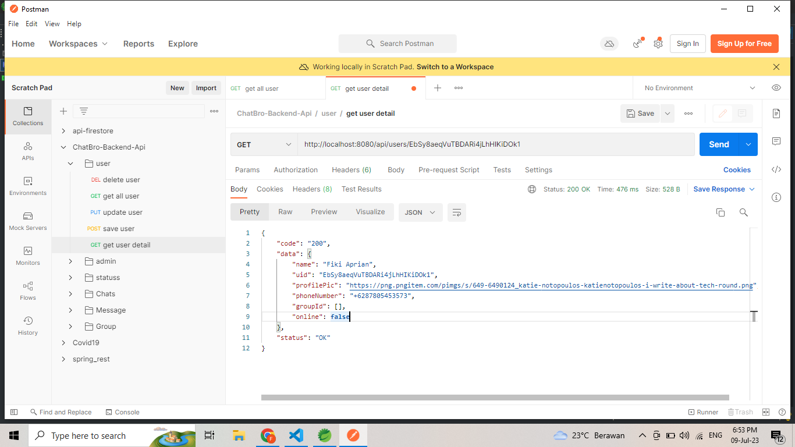

- Response gagal

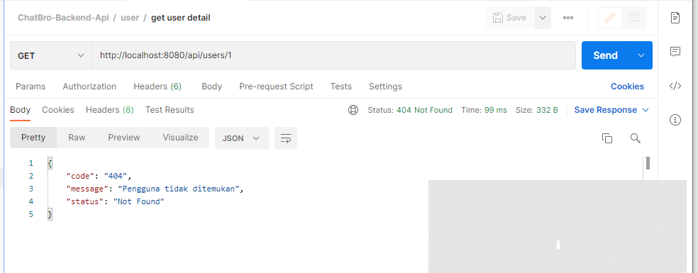

# No 7

Mampu menunjukkan dan menjelaskan Graphical User Interface dari
produk digital

Jawab:
Sourcode GUI dengan flutter:
[Frontend-Mobile](https://gitlab.com/fikiaprian23/fronted-chatbro)

- **Landing page**


- **Register**

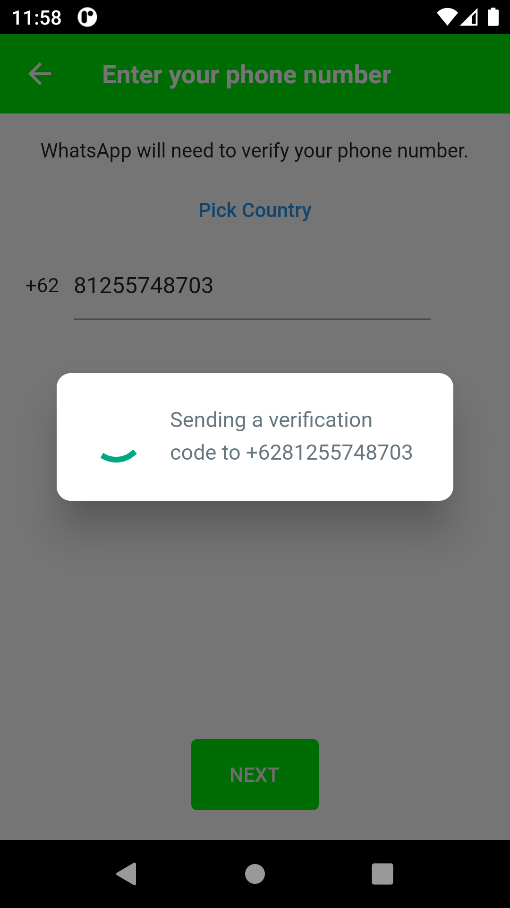

- **OTP**

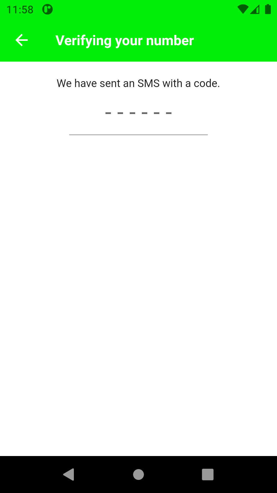

- **Grup**


- **User Chat**

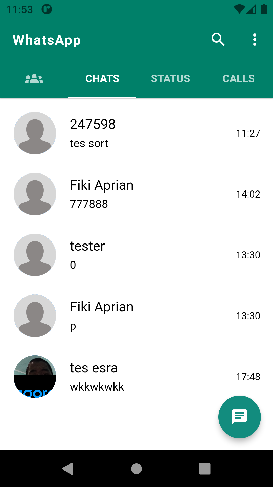

- **History call**

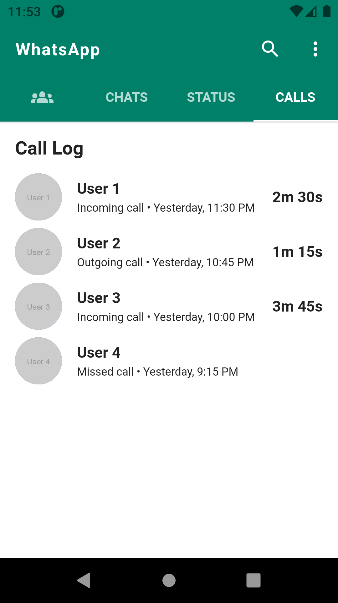

- **Status**

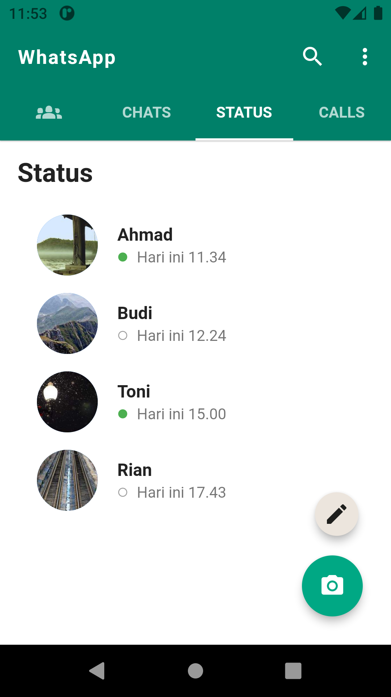

- **Select Contact**

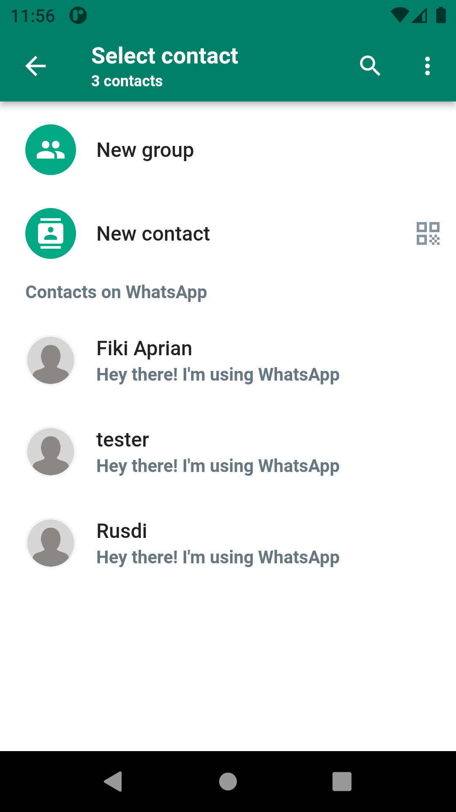

- **Chat Grup**

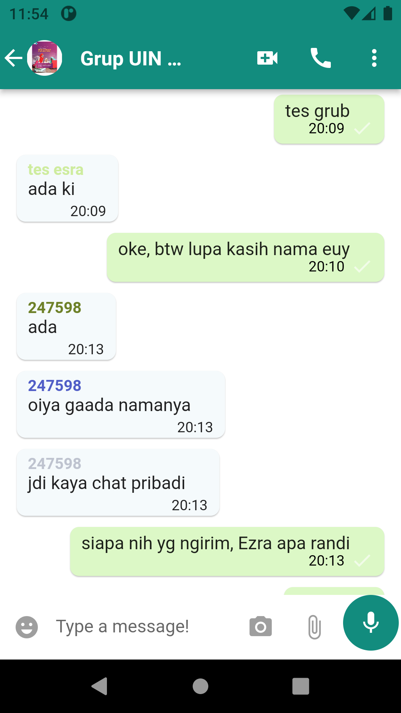

- **Chat Personal**

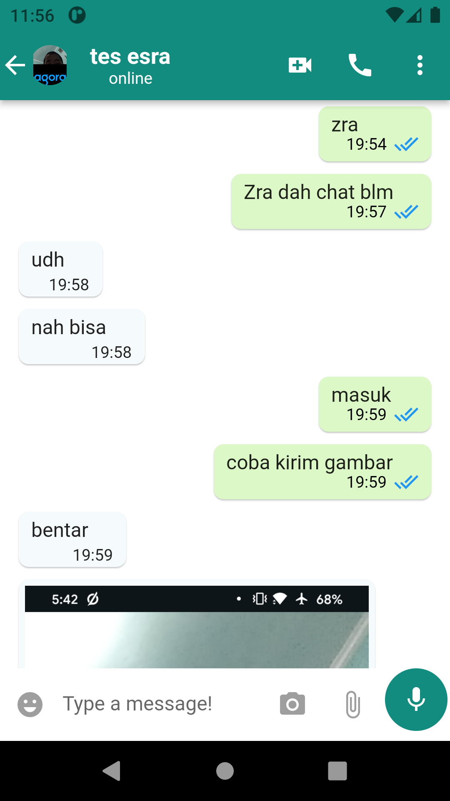

- **Profile teman**

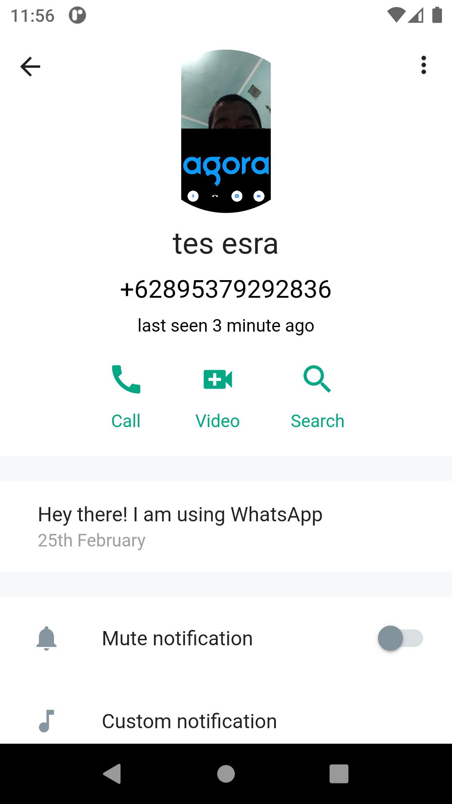

# No 8

Mampu menunjukkan dan menjelaskan HTTP connection melalui GUI produk digital

Jawab:

- GET

```dart
  Future<List<AdminModel>> getAllAdmins() async {
    var url = 'http://localhost:8080/api/admins'; // Ganti dengan URL API Anda

    try {
      var response = await http.get(Uri.parse(url));

      if (response.statusCode == 200) {
        var responseData = json.decode(response.body);
        List<AdminModel> admins = [];

        if (responseData['status'] == 'OK') {
          var adminDataList = responseData['data'];

          for (var adminData in adminDataList) {
            AdminModel admin = AdminModel.fromMap(adminData);

            admins.add(admin);
          }
        }

        return admins;
      }
    } catch (e) {
      print('Error occurred while fetching admins data: $e');
    }

    return [];
  }
```

```dart
  Future<AdminModel?> getCurrentAdminData() async {
    try {
      var uid = auth.currentUser?.uid;
      var apiUrl = 'http://localhost:8080/api/admins/$uid';

      var response = await http.get(Uri.parse(apiUrl));

      if (response.statusCode == 200) {
        var responseData = jsonDecode(response.body);
        if (responseData != null) {
          return AdminModel.fromMap(responseData['data']);
        }
      }
    } catch (e) {
      print('Error occurred while fetching user data: $e');
    }

    return null;
  }
```

```dart
  Future<List<UserModel>> getAllUsers() async {
    var url = 'http://localhost:8080/api/users'; // Ganti dengan URL API Anda

    try {
      var response = await http.get(Uri.parse(url));

      if (response.statusCode == 200) {
        var responseData = json.decode(response.body);
        List<UserModel> users = [];

        if (responseData['status'] == 'OK') {
          var userDataList = responseData['data'];

          for (var userData in userDataList) {
            UserModel user = UserModel.fromMap(userData);

            users.add(user);
          }
        }

        return users;
      }
    } catch (e) {
      print('Error occurred while fetching admins data: $e');
    }

    return [];
  }
```

- POST

```dart
  Future<ApiResponse> saveAdminToAPI(Map<String, dynamic> adminData) async {
    var url = 'http://localhost:8080/api/admins';

    try {
      var response = await http.post(
        Uri.parse(url),
        headers: {
          'Content-Type': 'application/json',
        },
        body: jsonEncode(adminData),
      );

      return ApiResponse(
        statusCode: response.statusCode,
        data: response.body,
      );
    } catch (e) {
      return ApiResponse(
        statusCode: -1, // Contoh kode status khusus untuk kesalahan jaringan
        data: 'Terjadi kesalahan jaringan: ${e.toString()}',
      );
    }
  }
```

```dart
 Future<void> postStatusToFirestore(
      Status status, BuildContext context) async {
    try {
      var url = Uri.parse('http://localhost:8080/api/statuss');
      var headers = {'Content-Type': 'application/json'};
      var body = jsonEncode(status.toMap());

      var response = await http.post(url, headers: headers, body: body);

      if (response.statusCode == 200) {
        // ignore: use_build_context_synchronously
        showAlertDialog(
            context: context,
            message: 'Status posted to Firestore API successfully');
      } else {
        // ignore: use_build_context_synchronously
        showAlertDialog(
            context: context,
            message: 'Failed to post status to Firestore API');
      }
    } catch (e) {
      showAlertDialog(
          context: context,
          message: 'Error occurred while posting status to Firestore API: $e');
    }
  }
```

- PUT

```dart
Future<void> putAdminData(String uid, Map<String, dynamic> updatedData) async {
  try {
    var url = Uri.parse('http://localhost:8080/api/admins/$uid');
    var headers = {'Content-Type': 'application/json'};
    var body = jsonEncode(updatedData);

    var response = await http.put(url, headers: headers, body: body);

    if (response.statusCode == 200) {
      print('Admin data updated successfully');
    } else {
      print('Failed to update admin data');
    }
  } catch (e) {
    print('Error occurred while updating admin data: $e');
  }
}

```

- DELETE

```dart
Future<void> deleteAdminData(String uid) async {
  try {
    var url = Uri.parse('http://localhost:8080/api/admins/$uid');

    var response = await http.delete(url);

    if (response.statusCode == 200) {
      print('Admin data deleted successfully');
    } else {
      print('Failed to delete admin data');
    }
  } catch (e) {
    print('Error occurred while deleting admin data: $e');
  }
}

```

# No 9

Mampu Mendemonstrsikan produk digitalnya kepada publik dengan cara-cara kreatif melalui video Youtube

Jawab:

**Video Demo Project UTS**


**[Link Youtube](https://youtu.be/XR-BveZi0fU)**

**Video Demo Project UAS**


**[Link Youtube](https://youtu.be/XR-BveZi0fU)**


# No 10

BONUS !!! Mendemonstrasikan penggunaan Machine Learning

```

```
